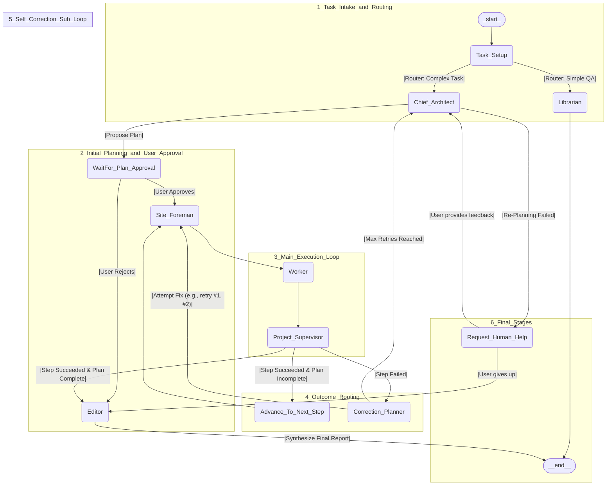

# Agentic Architecture for Bioinformatics/Epidemiology Workflows

**Stack** LangGraph (Python & Node.js) · Preact/Vite · Docker · SQLite 3

---

## 1. High‑Level Flow (Mermaid)



---

## 2. Design Assessment

### 2.1 Strengths

| Aspect                             | Impact                                                      |
| ---------------------------------- | ----------------------------------------------------------- |
| **Hierarchical Planner/Executor**  | Keeps reasoning coherent and cost‑efficient.                |
| **Human‑in‑the‑Loop (HITL) Gates** | Guarantees user control at critical junctures.              |
| **Autonomous Self‑Correction**     | Recovers from transient LLM/tool errors without escalation. |
| **Outcome‑based Routing**          | Ensures deterministic completion or explicit failure path.  |

### 2.2 Potential Blind Spots & Fixes

| Concern                        | Mitigation                                                                        |
| ------------------------------ | --------------------------------------------------------------------------------- |
| Missing shared memory          | Add **Knowledge‑Hub** (SQLite or Vector‑DB) accessible by all nodes.              |
| Lack of automated verification | Insert **Verifier** node (LLM‑judge or rule‑based).                               |
| Retry oscillations             | Persist error signature; fast‑fail on repeat.                                     |
| Security & cost guard‑rails    | Add **PolicyGuard** before any external tool call.                                |
| Serial execution latency       | Allow `Site_Foreman` to spawn parallel `Worker_i`; merge in `Project_Supervisor`. |
| Auditability                   | Record structured trace (`step_id`, inputs, outputs, tool\_calls).                |

---

## 3. Implementation Blueprint

### 3.1 Process Boundaries

```
┌──────────────┐  WebSockets/SSE  ┌─────────────┐  gRPC/REST  ┌─────────────┐
│  Preact UI   │◄───────────────►│ Node API    │────────────►│ Tool‑X Ctnr │
└──────────────┘                 │ (LangGraph) │             └─────────────┘
                                 │  + SQLite   │
                                 └─────────────┘
```

* **Option A** – LangGraph **Python** container exposes REST (FastAPI).
* **Option B** – LangGraph **JS** runs inside Node API if single‑language preferred.

### 3.2 LangGraph Graph with SQLite (Python)

```python
from langgraph.graph import StateGraph, START
from langgraph.checkpoint.sqlite import SqliteSaver
from nodes import task_setup, chief_arch, site_foreman, worker, supervisor,
                  correction_planner, request_human, editor, librarian

saver = SqliteSaver.from_conn_string("file:/data/agent.db?mode=rwc")

graph = StateGraph(name="bio_agent", saver=saver)

graph.add_node("Task_Setup", task_setup)
# … add remaining nodes & edges …

graph.compile(checkpointer=saver).serve()  # REST streaming
```

*The built‑in `SqliteSaver` snapshot every super‑step; replay/rollback is O(1).*

### 3.3 Node Client (TypeScript)

```ts
import { Client } from "@langchain/langgraph-sdk";
const client = new Client();

const thread = await client.threads.create();
for await (const delta of client.runs.stream({
  assistant_id: "bio_agent",
  thread_id: thread.id,
  messages: [{ role: "human", content: "Run a phylogeny pipeline" }],
})) {
  sendToUI(delta);   // push tokens to Preact state
}
```

### 3.4 Docker‑Compose Skeleton

```yaml
version: "3.9"
services:
  agent-py:
    build: ./agent
    volumes: ["agent_data:/data"]
    environment: ["OPENAI_API_KEY=${OPENAI_API_KEY}"]
  node-api:
    build: ./node
    volumes: ["agent_data:/data"]
    depends_on: [agent-py]
volumes:
  agent_data:
```

* Enable `PRAGMA journal_mode=WAL;` in Python process to improve concurrency.

### 3.5 Tool Containers

* Wrap each heavy tool (e.g. BLAST, Nextstrain) with a minimal RPC layer.
* Store outputs in `artifacts` table (`artifact_id`, path, mime, step\_id).

### 3.6 Good‑Practice Checklist

| Category         | Recommendation                                                  |
| ---------------- | --------------------------------------------------------------- |
| Observability    | Export spans (node, prompt, cost) to **LangSmith** or OTLP.     |
| Testing          | Unit‑test each node with stubbed LLM; weekly integration test.  |
| Security         | PolicyGuard limits budget & blocks disallowed tool params.      |
| Schema Evolution | Version SQLite schema; migrate via Alembic or `better‑sqlite3`. |
| Backup           | Hourly `.backup` to object storage; 30‑day retention.           |

---

## 4. Key Take‑Aways

1. **LangGraph + SqliteSaver** delivers durable agent state with minimal code.
2. **Streamed runs** integrate smoothly into a live Preact interface via `useStream`.
3. **Docker‑compose + shared WAL SQLite** handles moderate concurrency; upgrade to Postgres when sustained writes exceed \~100 QPS.
4. **Memory, verifier, and guard‑rails** close most robustness & safety gaps.

---

## 5. Further Reading

1. CrewAI Planner/Flow design docs (2025‑01).
2. Microsoft AutoGen “planner/assistant/critic” pattern (CHI 2024).
3. LangGraph documentation – Checkpointing & Streaming (2025‑03).
4. Reflective MCTS for language agents – Gao et al., ICLR 2025.
5. Better‑SQLite3 performance guide – GitHub README (2024‑10).
